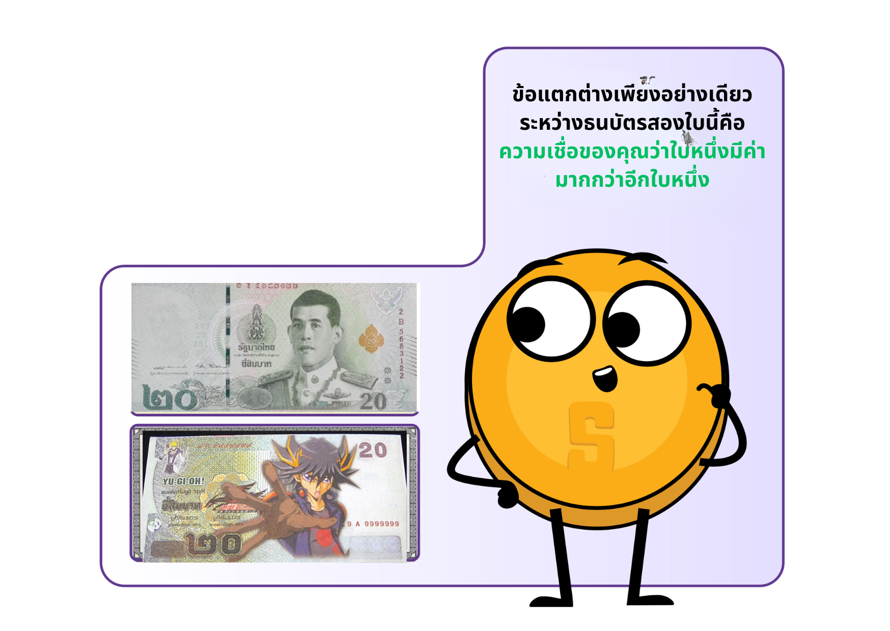

# กิจกรรม: อภิปรายในชั้นเรียน - “เงินคืออะไร”

* ⭐ กรุณาอย่าเพิ่งกินลูกอมที่วางอยู่บนโต๊ะ
* ⭐ ใครยินดีที่จะแลกเปลี่ยนลูกอมกับธนบัตร 20 บาท?
* ⭐ ตอนนี้ ใครยังคงยินดีที่จะแลกเปลี่ยนลูกอมกับธนบัตร 20 บาทจากเกมส์เศรษฐี ยกมือขึ้น
* ⭐ เพราะอะไร หรือเพราะอะไรถึงไม่?
* ⭐ อะไรที่ทำให้ธนบัตรใบหนึ่งเป็นที่ต้องการ ในขณะที่อีกใบหนึ่งไร้ค่า?
* ⭐ อะไรที่ทำให้เงินมี "มูลค่า"?
* ⭐ เงินมาจากไหน และใครเป็นผู้ตัดสินใจว่าจะพิมพ์เท่าไหร่?
* ⭐ ทำไมไม่พิมพ์เงินเพิ่มแล้วแจกจ่ายให้ทุกคนเท่าๆ กัน?

<figure><figcaption></figcaption></figure>

