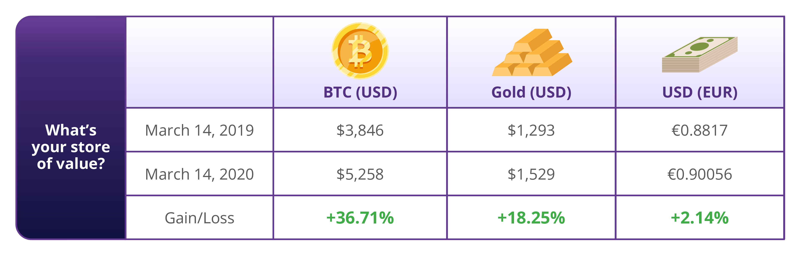

# 2.2 หน้าที่ของเงิน

เมื่อพูดถึงการซื้อและขายสินค้าและบริการ เงินคือตัวละครหลัก เงินมีหน้าที่สำคัญหลายประการในโลก เช่น:

**1. เก็บรักษามูลค่า:** เงินควรจะรักษามูลค่าไว้ได้เมื่อเวลาผ่านไป ทำให้มีประโยชน์ในการเก็บออมและลงทุนจากมูลค่าแรงงานของมนุษย์ สิ่งนี้ทำให้ผู้คนสามารถใช้เงินเพื่อวางแผนอนาคต กู้ยืม และให้ยืมเงิน ดังนั้น ในครั้งต่อไปที่คุณกำลังเก็บเงินเพื่อสิ่งที่พิเศษ จำไว้ว่าเงินเป็นมากกว่าวิธีการชำระเงิน แต่มันเป็นเครื่องมือที่จะช่วยคุณวางแผนและลงทุนในอนาคตของคุณ

<figure><figcaption></figcaption></figure>

**2. สื่อกลางในการแลกเปลี่ยน:** ด้วยเงิน คุณไม่จำเป็นต้องหาคนที่ต้องการแลกเปลี่ยนสิ่งที่คุณมีอยู่พอดี แต่คุณสามารถใช้เงินซื้อและขายอะไรก็ได้ที่คุณต้องการ สิ่งนี้ทำให้การค้าขายและพาณิชย์สะดวกและมีประสิทธิภาพมากขึ้น

<figure><figcaption></figcaption></figure>

**3. หน่วยของบัญชี:** เงินเป็นมาตรฐานสากลของมูลค่าที่ช่วยให้ผู้คนสามารถแสดงและเปรียบเทียบราคาของสินค้าและบริการที่แตกต่างกัน สิ่งนี้ช่วยให้ตลาดมีประสิทธิภาพและโปร่งใสมากขึ้น ซึ่งผู้คนสามารถตัดสินใจอย่างชาญฉลาดเกี่ยวกับสิ่งที่ควรซื้อและขาย

<figure><figcaption></figcaption></figure>

ลองนึกภาพแบบนี้: ถ้าคุณต้องการซื้อรถใหม่ คุณสามารถเปรียบเทียบราคาจากตัวแทนจำหน่ายต่างๆ และตัดสินใจอย่างชาญฉลาดว่าจะซื้อคันไหนโดยพิจารณาจากราคาเป็นดอลลาร์ หากไม่มีหน่วยของบัญชี คุณจะต้องพยายามเปรียบเทียบมูลค่าของรถคันหนึ่งกับอีกคันหนึ่งโดยใช้สิ่งอื่น เช่น จำนวนวัวที่มันคุ้มค่า หรือระยะเวลาที่ใช้ในการผลิตรถ

หน้าที่ทั้งสามนี้เป็นสิ่งที่ช่วยให้เศรษฐกิจมีความซับซ้อนและมีพลวัต หากไม่มีเงิน การซื้อและขายสินค้าและบริการจะเป็นเรื่องยากมาก และเศรษฐกิจของเราจะพัฒนาน้อยลงมาก

**แบบฝึกหัดในชั้นเรียน: ตัวอย่างนี้เป็นหน้าที่ของเงินแบบใด?**

* ⭐ อีวานตัดสินใจเก็บเงินส่วนหนึ่งจากเงินเดือนประจำสัปดาห์ของเขาเพื่อซื้อลูกสุนัข **(เก็บรักษามูลค่า)**&#x20;
* ⭐ อดัมซื้อพิซซ่าสองชิ้นในราคา 8.30 ดอลลาร์ที่ร้าน Ray's Pizza **(สื่อกลางในการแลกเปลี่ยน)**
* ⭐ มาร์คไม่สามารถตัดสินใจได้ว่าจะซื้อตั๋วคอนเสิร์ตราคา 75 ดอลลาร์หรือซื้อบัตรเล่นสกีราคา 95 ดอลลาร์ **(หน่วยของบัญชี)**
