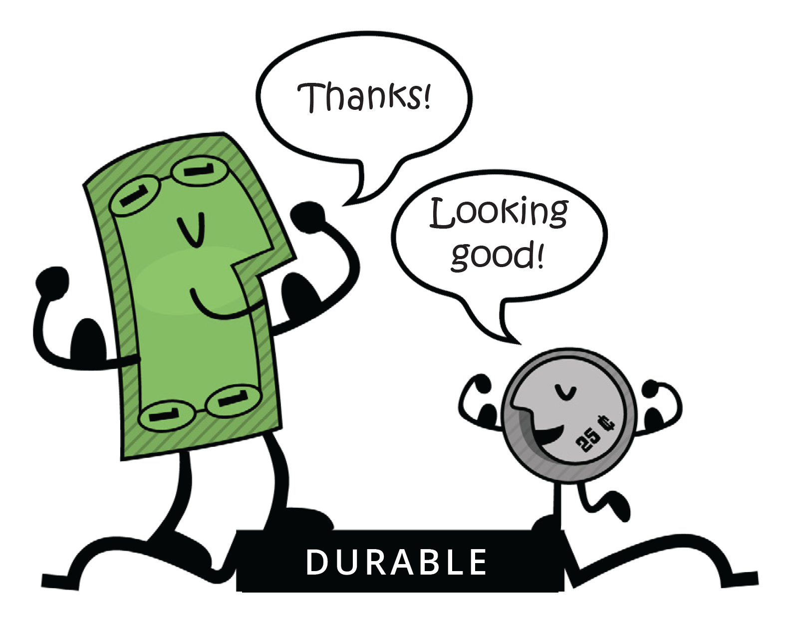
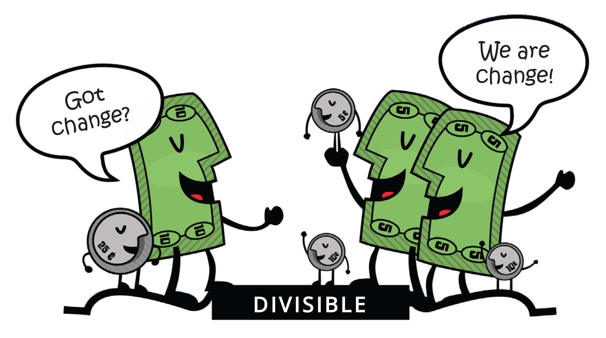
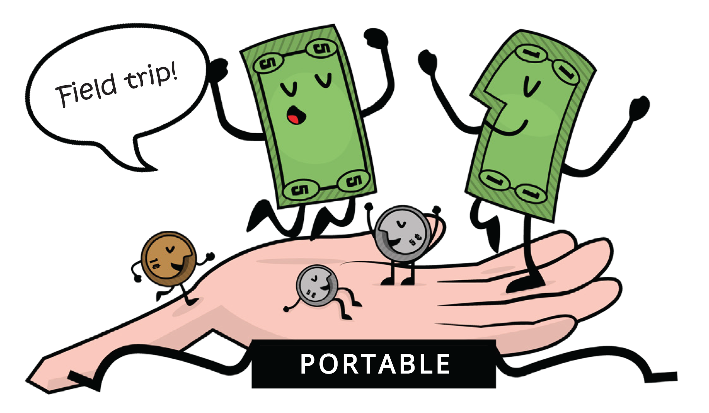
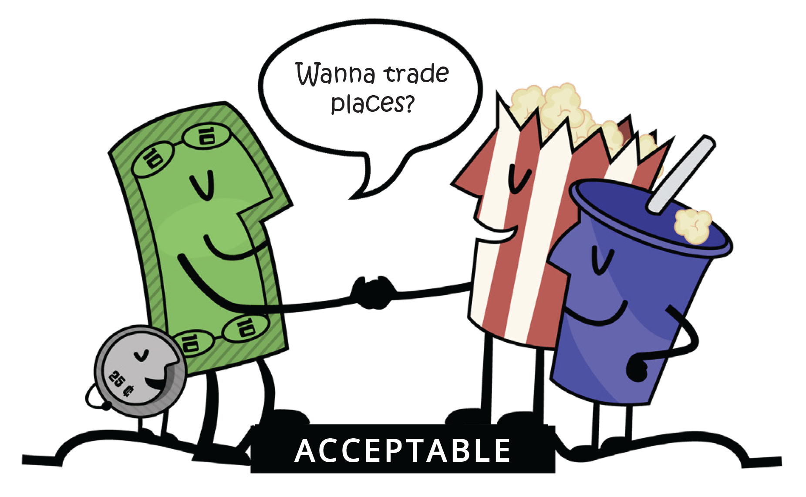
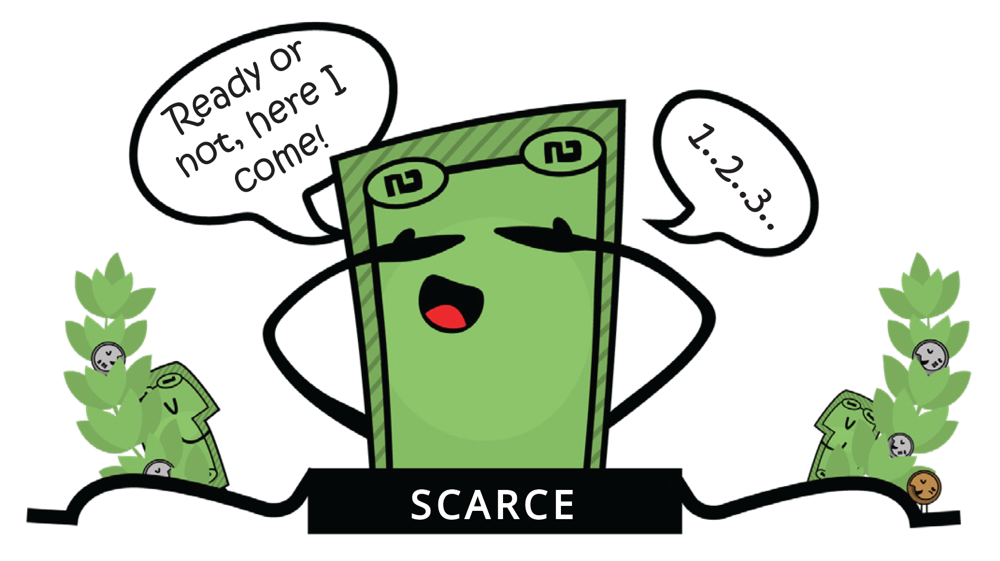
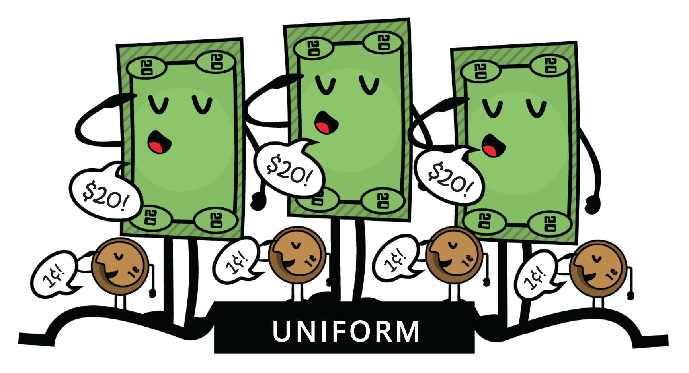

# 2.3 คุณสมบัติของเงิน

เมื่อเวลาผ่านไป ผู้คนตระหนักได้ว่าเงินต้องมีคุณสมบัติบางอย่างจึงจะมีประสิทธิภาพในการเป็นสื่อกลางในการแลกเปลี่ยน คุณสมบัติเหล่านี้ ได้แก่ ความทนทาน ความสามารถในการแบ่งแยก ความสะดวกในการพกพา การยอมรับ ความขาดแคลน และความสามารถในการทดแทนกันได้

⭐ **ความทนทาน** หมายถึงความสามารถของเงินในการต้านทานการเสื่อมสภาพทางกายภาพและคงอยู่ได้นาน สิ่งนี้ทำให้มั่นใจได้ว่าเงินสามารถหมุนเวียนในระบบเศรษฐกิจในสภาพที่ยอมรับได้และเป็นที่รู้จัก ทองคำเป็นวัสดุที่ทนทานซึ่งสามารถทนต่อการสึกหรอได้ ทำให้เป็นตัวแทนที่ดีของคุณสมบัติความทนทานของเงิน&#x20;

<figure><figcaption></figcaption></figure>

⭐ **ความสามารถในการแบ่งแยก** หมายถึงความสามารถของเงินในการแบ่งออกเป็นหน่วยย่อยๆ เพื่อให้ผู้คนสามารถใช้ซื้อสินค้าในปริมาณที่แตกต่างกันได้ ธนบัตรสามารถแบ่งออกเป็นหน่วยย่อยๆ ได้อย่างง่ายดาย ทำให้เป็นตัวแทนที่ดีของคุณสมบัติความสามารถในการแบ่งแยกของเงิน&#x20;

<figure><figcaption></figcaption></figure>

⭐ **ความสะดวกในการพกพา** หมายถึงความสะดวกในการขนส่งและพกพาเงินติดตัวไปด้วย สิ่งนี้ทำให้ผู้คนสามารถใช้เงินซื้อและขายสินค้าและบริการได้โดยไม่ยาก บัตรเครดิตพกพาสะดวก เนื่องจากสามารถพกติดตัวไว้ในกระเป๋าสตางค์หรือกระเป๋าถือได้ ทำให้เป็นตัวแทนที่ดีของคุณสมบัติความสะดวกในการพกพาของเงิน&#x20;

<figure><figcaption></figcaption></figure>

⭐ **การยอมรับ** หมายถึงการยอมรับเงินอย่างกว้างขวางว่าเป็นรูปแบบการชำระเงิน เพื่อให้ผู้คนสามารถใช้ซื้อและขายสินค้าและบริการได้อย่างมั่นใจ ดอลลาร์สหรัฐเป็นที่ยอมรับอย่างกว้างขวางว่าเป็นรูปแบบการชำระเงิน ทำให้เป็นตัวแทนที่ดีของคุณสมบัติการยอมรับของเงิน&#x20;

<figure><figcaption></figcaption></figure>

⭐ **ความขาดแคลน** หมายถึงปริมาณเงินที่มีจำกัด ซึ่งช่วยรักษามูลค่าของเงินและป้องกันไม่ให้เราต้องใช้เงินมากขึ้นเพื่อซื้อสินค้าในปริมาณเท่าเดิม แสตมป์สะสม โดยเฉพาะอย่างยิ่งแสตมป์ที่หายากและมีค่า สามารถเป็นรูปแบบของเงินที่ดีได้ เพราะหายากและมีมูลค่าเพิ่มขึ้นเมื่อเวลาผ่านไป นักสะสมแสตมป์มักใช้แสตมป์เป็นวิธีการลงทุนความมั่งคั่งและกระจายพอร์ตการลงทุน&#x20;

<figure><figcaption></figcaption></figure>

⭐ **ความสามารถในการทดแทนกันได้** หมายถึงความสามารถในการแลกเปลี่ยนเงิน เพื่อให้เงินหนึ่งหน่วยเทียบเท่ากับเงินอีกหน่วยหนึ่งที่มีมูลค่าเท่ากัน เงินควรจะเหมือนกัน เหรียญทองแดงมีขนาดและน้ำหนักเท่ากัน ทำให้เป็นตัวแทนที่ดีของคุณสมบัติความเหมือนกันของเงิน หนึ่งเซ็นต์จะเป็นหนึ่งเซ็นต์เสมอ&#x20;

<figure><figcaption></figcaption></figure>

โดยรวมแล้ว คุณสมบัติเหล่านี้ทำให้เงินเป็นเครื่องมือที่มีประโยชน์และมีประสิทธิภาพในการอำนวยความสะดวกด้านการค้าขาย และมีความสำคัญต่อการพัฒนาและความมั่นคงของเศรษฐกิจ

**แบบฝึกหัดในชั้นเรียน**

สินทรัพย์ที่แตกต่างกันมีคุณสมบัติที่แตกต่างกันและทำหน้าที่ของเงินในระดับที่แตกต่างกัน ในที่สุดสังคมจะเป็นผู้กำหนดว่าสินทรัพย์ใดจะถูกใช้เป็นเงินโดยพิจารณาจากปัจจัยต่างๆ เช่น ความมั่นคง ความขาดแคลน ความสามารถในการแบ่งแยก ความสามารถในการถ่ายโอน และการยอมรับว่าเป็นสื่อกลางในการแลกเปลี่ยน

ในการพิจารณาว่าสินค้าต่างๆ มีคุณสมบัติตรงตามลักษณะเฉพาะของเงินมากน้อยเพียงใด คุณสามารถให้คะแนนแต่ละรายการในระดับ 1 ถึง 5 สำหรับแต่ละลักษณะ โดยการรวมคะแนนสำหรับแต่ละรายการ คุณสามารถพิจารณาได้ว่ารายการใดเหมาะสมที่สุดที่จะเป็นรูปแบบของเงิน

\[ 0 = แย่มาก; 3 = พอใช้; 5 = ดีเยี่ยม ]

**กรุณาอย่ากรอกข้อมูลในคอลัมน์สำหรับ Bitcoin เราจะกลับมาพูดถึงเรื่องนี้ในภายหลัง**

ใช้คำถามต่อไปนี้เพื่อช่วยพิจารณาว่าสินค้าต่างๆ ในตารางมีคุณสมบัติตรงตามลักษณะของเงินมากน้อยเพียงใด

⭐ ความทนทาน: เงินสามารถทนต่อการสึกหรอเมื่อเวลาผ่านไปได้หรือไม่?&#x20;

⭐ ความสามารถในการทดแทนกันได้: เงินสามารถแลกเปลี่ยนกับเงินรูปแบบอื่นได้หรือไม่?&#x20;

⭐ การยอมรับ: เงินเป็นที่ยอมรับอย่างกว้างขวางว่าเป็นรูปแบบการชำระเงินหรือไม่?&#x20;

⭐ ความขาดแคลน: เงินหายากและมีไม่มากเกินไปหรือไม่?&#x20;

⭐ ความสะดวกในการพกพา: เงินสามารถขนส่งและใช้งานในสถานที่ต่างๆ ได้ง่ายหรือไม่?&#x20;

⭐ ความสามารถในการแบ่งแยก: เงินสามารถแบ่งออกเป็นหน่วยย่อยๆ สำหรับการทำธุรกรรมได้หรือไม่?

| คุณสมบัติของเงินที่ดี | 🐄 วัว | 🚬 บุหรี่ | 💎 เพชร | 💶 ยูโร | ₿ Bitcoin |
| --------------------- | ------ | --------- | ------- | ------- | --------- |
| ทนทาน                 |        |           |         |         |           |
| สะดวกในการพกพา        |        |           |         |         |           |
| เหมือนกัน             |        |           |         |         |           |
| ยอมรับได้             |        |           |         |         |           |
| ขาดแคลน               |        |           |         |         |           |
| แบ่งแยกได้            |        |           |         |         |           |
| รวม                   |        |           |         |         |           |
