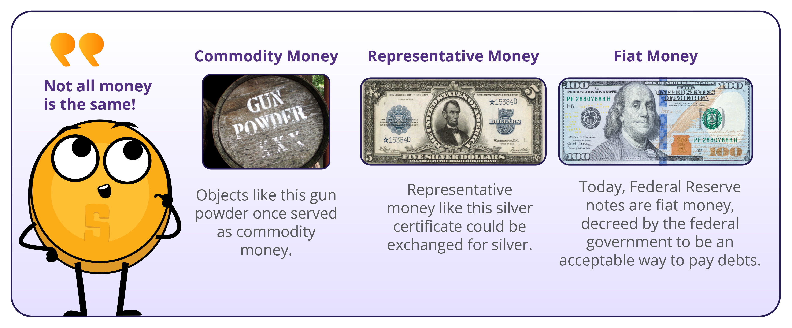
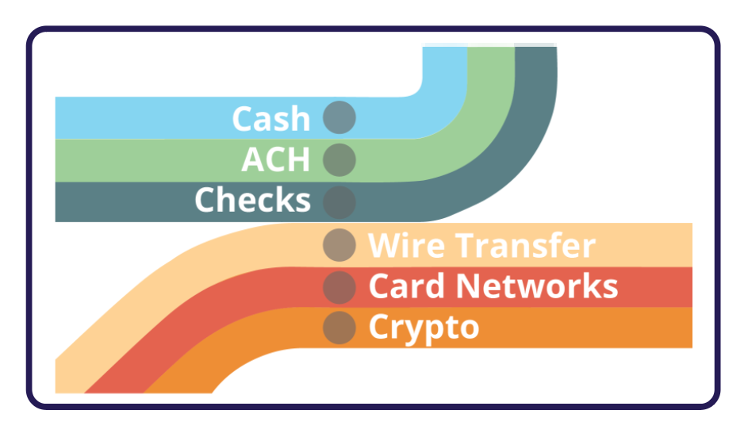

# 2.4 ประเภทของเงิน

เงินสามารถแบ่งออกเป็นสองประเภทหลักๆ คือ เงินที่จับต้องได้และเงินดิจิทัล

**เงินที่จับต้องได้** ได้แก่:

⭐ **เงินตรา** ซึ่งเป็นธนบัตรและเหรียญกษาปณ์ที่ออกโดยรัฐบาลและยอมรับให้เป็นสื่อกลางในการแลกเปลี่ยน&#x20;

⭐ **เงินที่เป็นตัวแทน** ซึ่งเป็นตัวแทนของการอ้างสิทธิ์ในสินค้าโภคภัณฑ์ที่จับต้องได้&#x20;

⭐ **เงินสินค้าโภคภัณฑ์** ซึ่งเป็นวัตถุที่จับต้องได้ที่มีมูลค่าในตัวเองและเป็นที่ยอมรับอย่างกว้างขวางว่าเป็นสื่อกลางในการแลกเปลี่ยน ตัวอย่างเช่น ทองคำและเงิน

<figure><figcaption></figcaption></figure>

💡 ในทางกลับกัน **สกุลเงินดิจิทัล** สามารถใช้สำหรับธุรกรรมออนไลน์และรวมถึงสกุลเงินอิเล็กทรอนิกส์ เหรียญ stablecoin และสกุลเงินดิจิทัล \
**สกุลเงินอิเล็กทรอนิกส์** เป็นสกุลเงินทั่วไปในรูปแบบดิจิทัล เช่น ดอลลาร์หรือยูโร และสามารถใช้ซื้อและขายสิ่งของออนไลน์ผ่าน **ช่องทางการชำระเงินแบบดิจิทัล**

<figure><figcaption></figcaption></figure>

ช่องทางการชำระเงิน คือ โครงสร้างพื้นฐานที่ช่วยให้สามารถเคลื่อนย้ายสกุลเงินอิเล็กทรอนิกส์และสินทรัพย์ดิจิทัลอื่นๆ จากที่หนึ่งไปยังอีกที่หนึ่งได้ อย่างไรก็ตาม ในระบบการเงินแบบดั้งเดิม จะมีคนกลางอยู่เสมอ เช่น ธนาคารหรือสถาบันการเงิน ซึ่งจะเรียกเก็บค่าธรรมเนียมและมีอำนาจในการยอมรับ ยกเลิก คืนเงิน หรือชะลอการทำธุรกรรม

ในระบบการเงินแบบคนกลาง ช่องทางการชำระเงินแบบดิจิทัลหลักๆ ได้แก่ เครือข่ายบัตร ซึ่งอำนวยความสะดวกในการโอนเงินระหว่างสถาบันการเงินและร้านค้าเมื่อลูกค้าทำการซื้อโดยใช้บัตรเดบิตหรือบัตรเครดิต และกระเป๋าเงินดิจิทัล ซึ่งเป็นบัญชีออนไลน์ที่อนุญาตให้ผู้ใช้จัดเก็บและจัดการสกุลเงินอิเล็กทรอนิกส์ของตน และชำระเงินโดยการโอนเงินจากบัญชีของตนไปยังบัญชีของผู้รับ

💡 **สกุลเงินดิจิทัลของธนาคารกลาง (CBDC)**: เป็นสกุลเงินตราของประเทศในรูปแบบดิจิทัล ซึ่งออกและรับรองโดยธนาคารกลางและมีรัฐบาลเป็นตัวกลาง&#x20;

💡 **Stablecoin** เป็นสกุลเงินดิจิทัลที่ออกแบบมาเพื่อรักษามูลค่าให้คงที่เมื่อเทียบกับสินทรัพย์ เช่น ดอลลาร์สหรัฐ&#x20;

💡 **สกุลเงินดิจิทัล** เป็นสกุลเงินดิจิทัลประเภทหนึ่ง สกุลเงินดิจิทัลบางสกุลมีการกระจายอำนาจและอยู่ภายใต้กฎเกณฑ์ ในขณะที่บางสกุลมีศูนย์กลางและควบคุมโดยคนกลุ่มเล็กๆ

ท้ายที่สุดแล้ว สกุลเงินที่ดำเนินการโดยไม่มีคนกลางจะมีประสิทธิภาพและเป็นประโยชน์ต่อสังคมมากกว่า เนื่องจากป้องกันไม่ให้บุคคลเพียงไม่กี่คนควบคุมปริมาณเงินและรวมอำนาจไว้ที่ตนเอง อย่างไรก็ตาม การสร้างสกุลเงินดังกล่าวที่อำนวยความสะดวกในการทำธุรกรรมที่ปลอดภัยโดยไม่ต้องอาศัยความไว้วางใจระหว่างกันเป็นความท้าทายตลอดประวัติศาสตร์ เพื่อให้บรรลุเป้าหมายนี้ ต้องสร้างสกุลเงินที่ทำงานเหมือนอินเทอร์เน็ต ซึ่งการควบคุมจะถูกกระจายไปยังทุกคนและไม่มีใครในเวลาเดียวกัน สิ่งนี้ต้องอาศัยข้อตกลงของทุกฝ่าย รวมถึงผู้ที่มีอำนาจ ในการสละการควบคุมเพื่อประโยชน์ส่วนรวม
